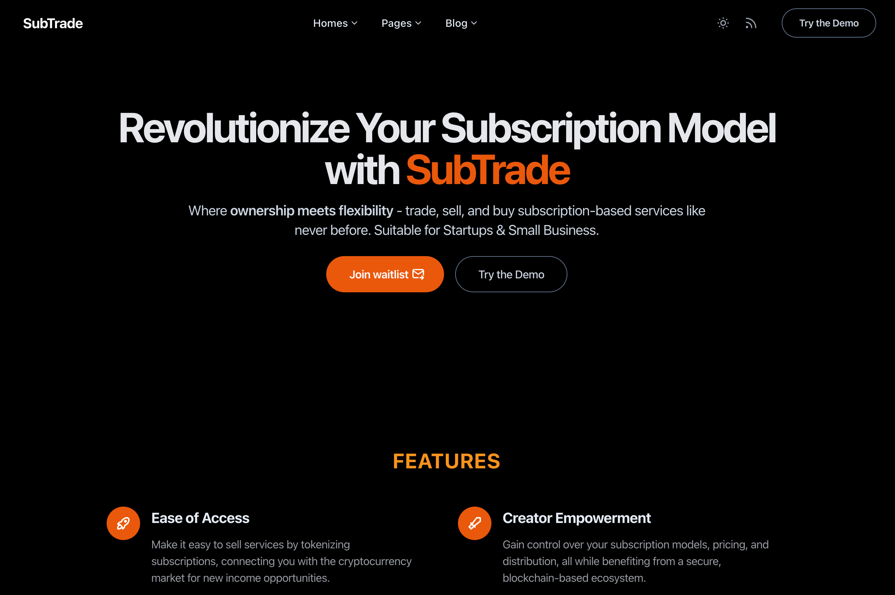

# 🚀 SubTrade

**SubTrade** is a platform that turns subscriptions into tradable tokens using blockchain and NFTs, allowing users to buy, sell, or swap them in a marketplace. This offers new revenue opportunities for companies and more choices for consumers.

- ✅ **Ease of Integration** Make it easy to sell services by tokenizing subscriptions, connecting you with the cryptocurrency market for new income opportunities.
- ✅ **Creator Empowerment** Gain control over your subscription models, pricing, and distribution, all while benefiting from a secure, blockchain-based ecosystem.
- ✅ **Flexibility for Users** Let users sell their subscriptions before they expire, making it easier for others to try the service.
- ✅ **Global Reach** Reach global customers easily by using cryptocurrency, avoiding traditional currency exchange and banking fees..

 

🌟 _Perfect Solution for creating subscription-based app in web3_. 🌟

 

## Demo

📌 [https://trade.subnft.xyz/demo](https://trade.subnft.xyz/demo)

 

## Getting started

**SubTrade** tries to give you quick access to solana NFT using [Metaplex core](https://developers.metaplex.com/core) + [Helius RPC](https://github.com/helius-labs/helius-sdk). It focuses on simplicity, good practices and high performance.

### Commands

All commands are run from the root of the project, from a terminal:

| Command               | Action                                             |
| :-------------------- | :------------------------------------------------- |
| `npm install`         | Installs dependencies                              |
| `npm run dev`         | Starts local dev server at `localhost:3000`        |
| `npm run build`       | Build your production site to `./dist/`            |
| `npm run preview`     | Preview your build locally, before deploying       |
| `npm run format`      | Format codes with Prettier                         |
| `npm run lint:eslint` | Run Eslint                                         |
| `npm run astro ...`   | Run CLI commands like `astro add`, `astro preview` |

 

## Frequently Asked Questions

- **Tell me what is SubTrade again?** SubTrade is a platform that turns subscriptions into tradable tokens using blockchain and NFTs, allowing users to buy, sell, or swap them in a marketplace. This offers new revenue opportunities for companies and more choices for consumers.
- **What is the cost of using SubTrade?** The service is free during the Early Access period. After that, prices will be set according to market feedback and the platform's value. We aim for clear, fair pricing that aligns with SubTrade's innovations.
- **How do I verify if a user has access permission to my service?** Use our API/SDK to check if a user owns a subscription NFT on the blockchain. If they do, they get access to your service. This keeps your user base exclusive to NFT holders.

 

## Contributing

If you have any idea, suggestions or find any bugs, feel free to open a discussion, an issue or create a pull request.
That would be very useful for all of us and we would be happy to listen and take action.
